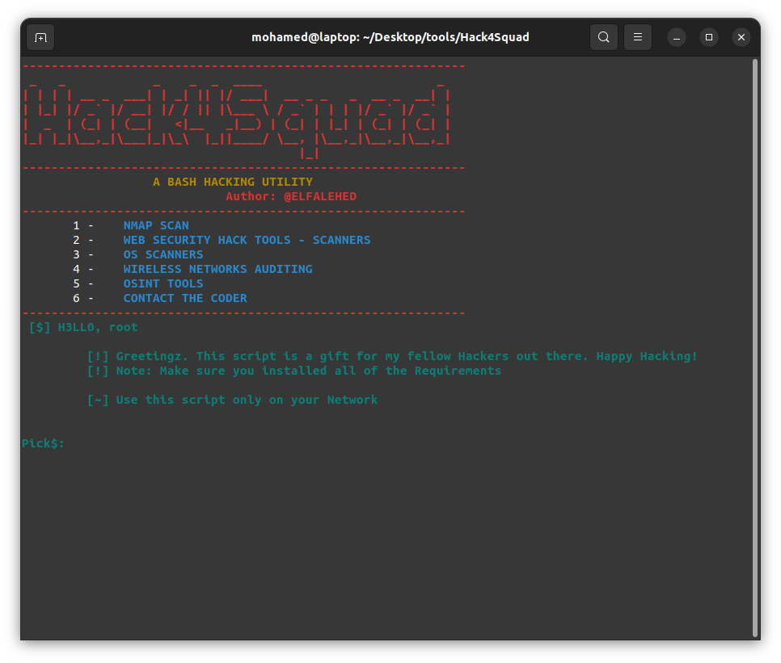

# :skull: Hack4Squad [](http://hits.dwyl.com/{KMx404}/{Hack4Squad}) [](https://github.com/dwyl/esta/issues) [](https://lgtm.com/projects/g/nmap/nmap/context:python)

A bash hacking utility driven by a Python script.

---

Hack4Squad is a collection for Hacking Tools (Bash and Python based) :computer: <br />



---

# Tools

1. Reconnaissance
   - Dirsearch
   - Nmap
   - Lynis
   - Wascan
   - Airgeddon
   - Scant3r
2. Exploitation
   - Airgeddon
3. OSINT
   - Sherlock
   - Photon

And more tools to be added soon.

# 1. Requirements

Please make sure these packages below are installed;

- [Git](https://git-scm.com/book/en/v2/Getting-Started-Installing-Git)
- [Python 3](https://docs.python-guide.org/starting/install3/linux/)
- [Pip](https://pip.pypa.io/en/stable/installing/)

# 2. Installation

- Note that this script must be run as root.

```Shell
$ chmod +x install.sh
$ sudo ./install.sh
```

# 3. Execution

```Shell
$ chmod +x Hack4Squad.sh
$ ./Hack4Squad.sh
```

---

# Status:

 **_In progress..._**

## 2DO:

- Complete the bash file (parts).
- Check NMAP scan.
- Audit wireless networks.
- Airgeddon features as a side tool.
- Driven python script only to be compatible.

<br />
